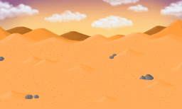

    
    <h1>Mortem</h1>
    

Mortem is a [libGDX](https://libgdx.com/) project free open-source inverted pixel-horror game where your objective is to decide human's fate.

## Table of Contents

1. [Controls](#controls)
2. [Tasks](#tasks)
3. [Mechanics](#mechanics)
4. [Levels](#Levels)
5. [Extras](#extras)

# Controls

> [!WARNING]
> Controls are subject to change.

| Button | Action |
|-------------------------------|----------------------------------------------------------------|
| Move mouse | Look around |
| Up, Down, Left, Right | Move |
| F1 | Generate humans |
| 1, 2, 3, 4, 5, 6... | Move between maps |

# Tasks

> [!TIP]
> Keep the table updated.

- [x] Escenario (Hecho)
- [x] Movimientos (Hecho)
- [x] Sprites (Hecho)
- [x] NPCs (Hecho)
- [x] Ataque a los NPCs (Hecho)
- [x] Hitbox paredes (Hecho)
- [ ] \(En proceso) Escenarios
- [ ] Mejora de Código
- [ ] [Cámara](https://github.com/raeleus/viewports-sample-project?tab=readme-ov-file#camera-position)
- [ ] Puntuación
- [ ] Muerte
- [ ] [IA de los NPCs](https://github.com/libgdx/gdx-ai/wiki)
- [ ] Pantalla de inicio
- [ ] Música
- [ ] Fin
- [ ] Créditos

# Mechanics

- [x] Matar personas
- [ ] \(En proceso) Cambiar de nivel
- [ ] Cambio de modo
- [ ] Muerte

# Levels

- [ ] Oficina
- [ ] \(En proceso) Desierto

- [ ] \(Opcional) Casas

## Tipos de niveles

- Estáticos
  - Con borde
  - Sin borde
- Dinámicos

# Extras

- [ ] Transiciones
- [ ] Soporte para mando
- [ ] Créditos