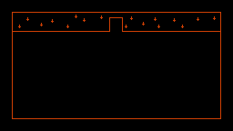
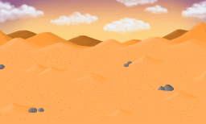

    
    <h1>Mortem</h1>
    

Mortem is a [libGDX](https://libgdx.com/) project free open-source inverted pixel-horror game where your objective is to decide human's fate.

## Table of Contents

1. [Controls](#controls)
2. [Tasks](#tasks)
3. [Mechanics](#mechanics)
4. [Levels](#Levels)
5. [Extras](#extras)

# Controls

> [!WARNING]
> Controls are subject to change.

| Button                | Action            |
|-----------------------|-------------------|
| Up, Down, Left, Right | Move              |
| F1                    | Generate humans   |
| 1, 2, 3, 4, 5, 6...   | Move between maps |

# Tasks

> [!TIP]
> Keep the table updated.

- [x] Stage
- [x] Moveset
- [x] Sprites
- [x] NPCs
- [x] Attack to NPCs
- [x] Character hitbox
- [x] Walls hitbox
- [x] Code improvements
- [x] Stages  
- [ ] \(In process) Code separation
- [ ] [Camera](https://github.com/raeleus/viewports-sample-project?tab=readme-ov-file#camera-position)
- [ ] Score
- [ ] Death
- [ ] [NPCs AI](https://github.com/libgdx/gdx-ai/wiki)
- [ ] Start screen
- [ ] Music
- [ ] End
- [ ] Credits

# Mechanics

- [x] Kill people
- [x] Change level
- [ ] Gamemode change
- [ ] Death

# Levels

- [x] Test

- [ ] \(In process) Office
- [x] Desert

- [ ] \(In process) Beach
- [ ] \(Optional) Houses

## Tipos de niveles

- Static
  - With border
  - Without border
- Dynamic

# Characters
- [x] Spider
  - [x] Old
  - [x] Modern
  
- [ ] Humans
  - [x] Old
  - [ ] Modern

# Extras

- [ ] Transitions
- [ ] Mechanics with gamemode change
- [ ] Controller support
- [ ] Credits